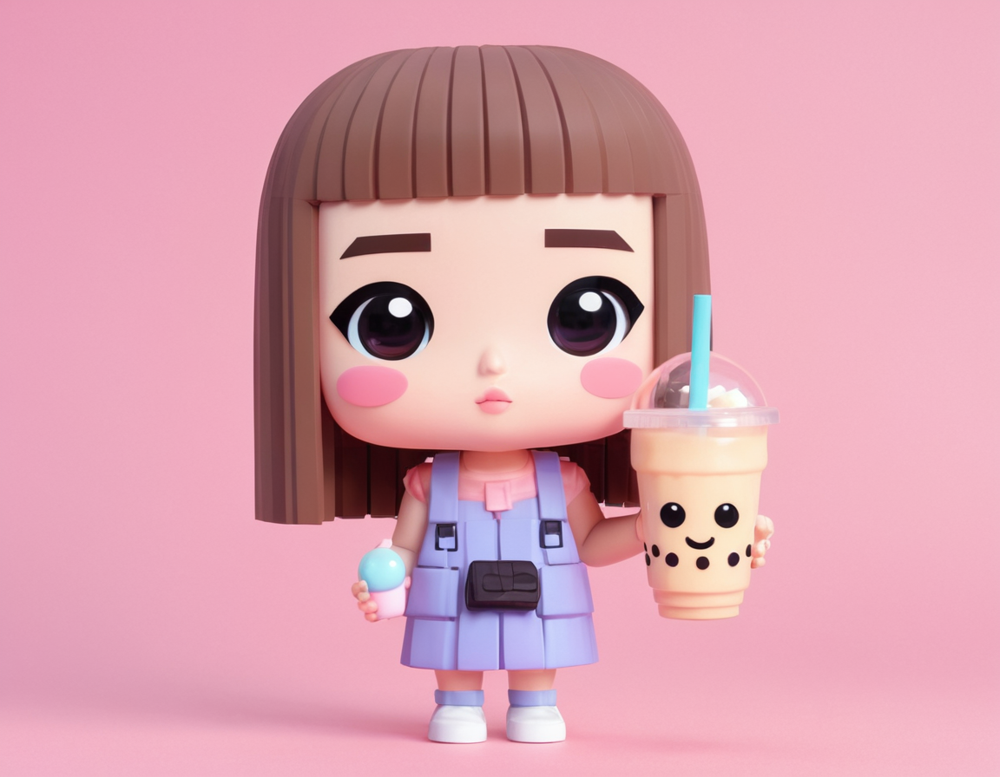

# 情境
- 角色設定關鍵字：公仔設計師/泡泡瑪特愛好者/女性角色
- 目標：

---

# 嘗試

首先使用 [官方網站](https://fooocus.co/playground)
> prompt:
> big shiny eyes, vinyl toy figure, cute collectible art toy, chibi proportions, 3D render, POP MART aesthetic
> Note that it should be a GIRL!!!!

結果根本八竿子打不著
.jpg)

所以乖乖下載 conda 和 fooocus

> prompt:
> big shiny eyes, vinyl toy figure, cute collectible art toy, chibi proportions, 3D render, POP MART aesthetic
（沒有強調非得是女生）
.png)

這很泡泡瑪特！

## 過程中遇到的困難
圖片生成時間過長，要花 1.5 hr 左右。查了網上的說法，發現不正常，於是問 ChatGPT。他說問題是出在 `Base model loaded: juggernautXL_v8Rundiffusion.safetensors` 上面。

> 這是基於 SDXL 架構 的模型，不是 SD1.5，它體積超大、非常吃資源：
> 你在 沒使用 GPU 的情況下跑 SDXL 模型 → 非常慢（數小時）

於是試著換成 `Deliberate_v2.safetensors`，同時也實驗把模型換掉，效果是否改變。
但失敗了。

所以我還是使用原本的方式、下一樣的 prompt：
> big shiny eyes, vinyl toy figure, cute collectible art toy, chibi proportions, 3D render, POP MART aesthetic

但是這次，我有但是這次，我把上次的成果作為 input image ，並且 inpaint

# 總結
環境的設定依然是比較困難的部分，沒有太多選擇的空間。比如我原本想要把 Fooocus clone 下來後直接用，結果發現自己是 python 3.13，和他的套件不相容 (python3.10)，只好認命換版本。
又，本來想說用 pyenv，結果還是不行，只好真的再多安裝一個 conda。
目前嘗試換模型也失敗，他總會自動把那個我跑不動的模型下載回來，推測是 .json 中的設定，但尚未找到解決方法。