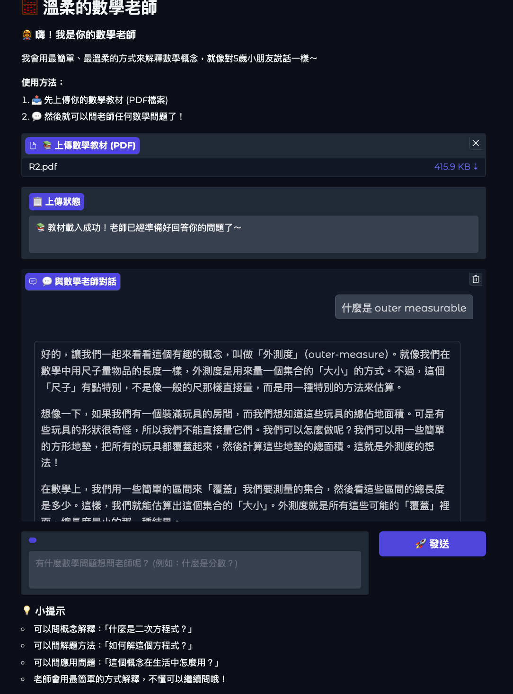

# 使用教材
本專案使用的核心教材是：
《Lebesgue Measure》章節 - 來自高等數學分析教科書
資料特性:
- 內容領域：測度論 (Measure Theory)
- 學術層次：大學高年級/研究所程度
- 頁數範圍：第二章完整內容 (約20頁)

# 教師風格
1. ELI5 方法論 (Explain Like I;m 5)
2. 漸進式教學：
3. 互動原則

# 對話成果展示
