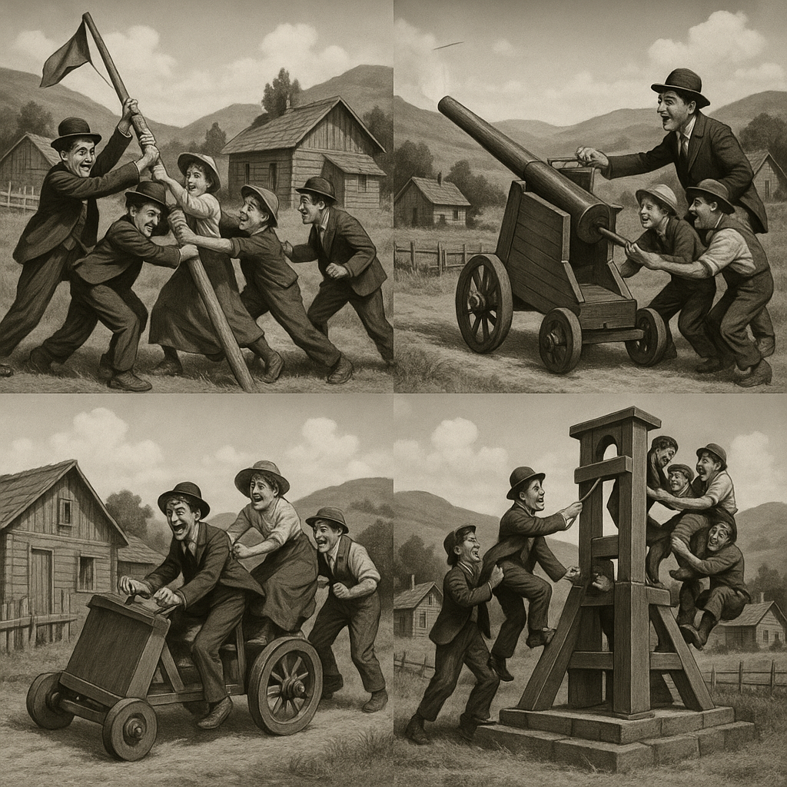
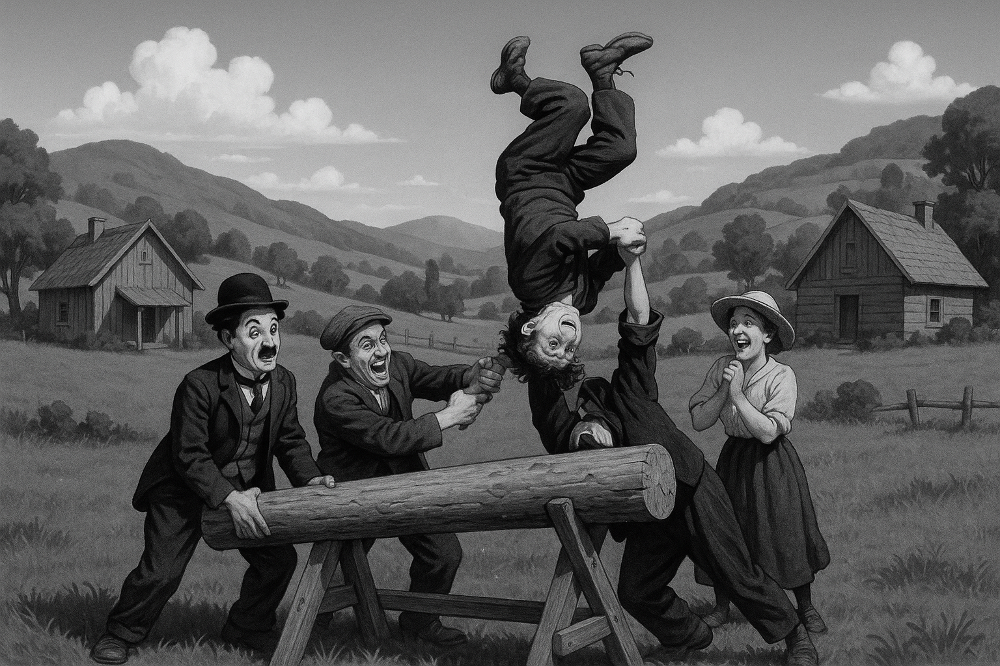
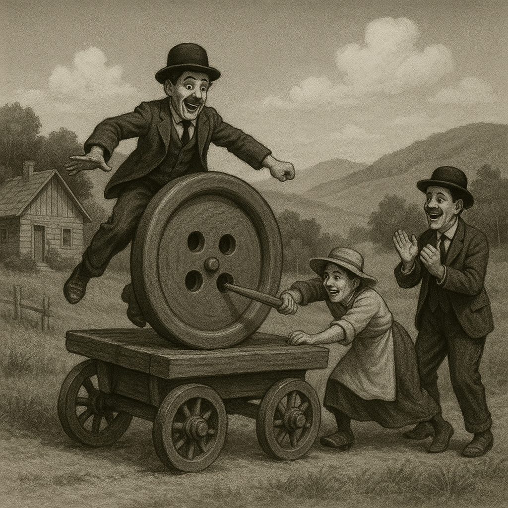
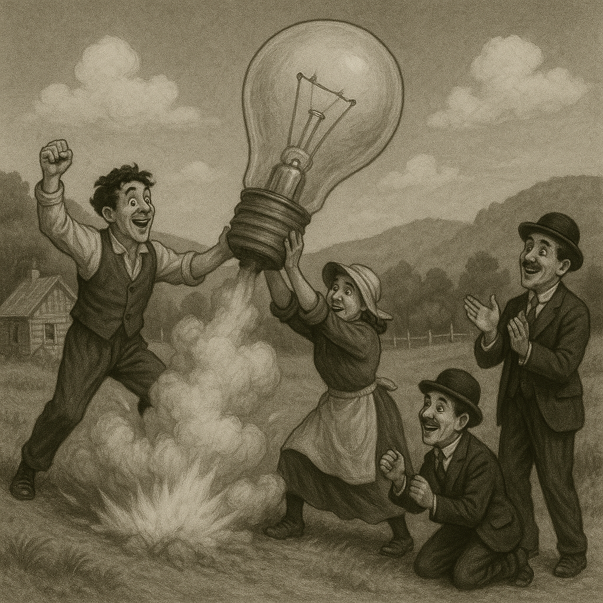

> 一個寧靜的鄉村風景，有著小木屋、翠綠的山丘與晴朗的藍天，人們嬉鬧活動，他們在做一些好玩的是，但我不知道那是什麼，請你自由發揮，只知道那是一個很革命性的場景。請以卓别林風格呈現。

---

---
根據上述圖片，我們可以知道關鍵在於「對 AI 來說，何謂『革命性』」？
第四張圖片中，「愛迪生發明電燈泡」確實是一項「革命性的發明」（雖然中文比較少這樣說），同樣地，輪胎也是一樣的道理。
兒在第一張圖片裡，我們又可見戰爭、槍砲，這裡的「革命性」成為貨真價實的「革命」。
而這種多語意的畫面，在 AI 生成的圖片中，清晰可見。